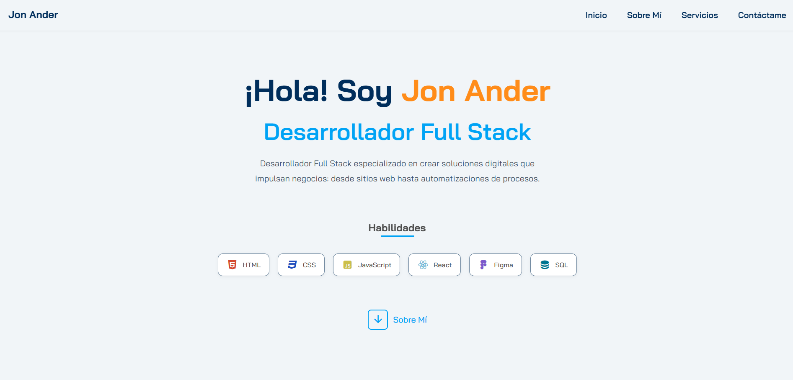

# Portfolio Profesional - Jon Ander

Bienvenido a mi portfolio profesional, donde presento una selección de mis servicios y proyectos desarrollados con tecnologías front-end como HTML, CSS y JavaScript.

---

## Vista previa

A continuación, una captura de la primera sección de mi portfolio:

---

## Sobre mí

Soy un desarrollador frontend apasionado por crear experiencias digitales atractivas, intuitivas y funcionales. Mi enfoque combina diseño y desarrollo para ofrecer soluciones web modernas, optimizadas y accesibles. Me comprometo con la mejora continua, el aprendizaje constante y la aplicación de las mejores prácticas en desarrollo web.

Visita mi página web: [jonandercasado.github.io/portfolio](https://jonandercasado.github.io/portfolio/)

---

## Servicios profesionales

Ofrezco una gama de servicios enfocados en potenciar la presencia digital de mis clientes mediante soluciones tecnológicas eficientes y creativas:

- **Desarrollo Web:** Diseño y construcción de sitios web modernos, responsivos y optimizados para la mejor experiencia de usuario.
- **Backend:** Implementación de lógica de negocio y bases de datos para soluciones robustas y seguras.
- **Hosting Web:** Configuración y despliegue de sitios en servicios de hosting confiables y escalables.
- **Diseño UI/UX:** Creación de interfaces intuitivas y experiencias de usuario memorables que mejoran la interacción y conversión.

---

## Tecnologías utilizadas

Mi stack tecnológico se centra en herramientas y lenguajes modernos para garantizar la calidad y mantenibilidad de los proyectos:

- HTML5
- CSS3 (Flexbox, Grid, animaciones)
- JavaScript (ES6+)

---

## Contacto

Estoy abierto a nuevas oportunidades, colaboraciones y consultas. Puedes ponerte en contacto conmigo o revisar más proyectos visitando mi perfil en GitHub:

- [GitHub](https://github.com/jonandercasado)

---

Gracias por tomarte el tiempo de conocer mi trabajo y servicios.  
Espero poder contribuir a tus próximos proyectos digitales.
